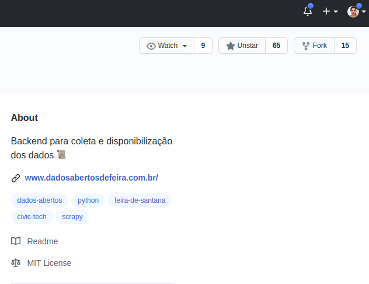
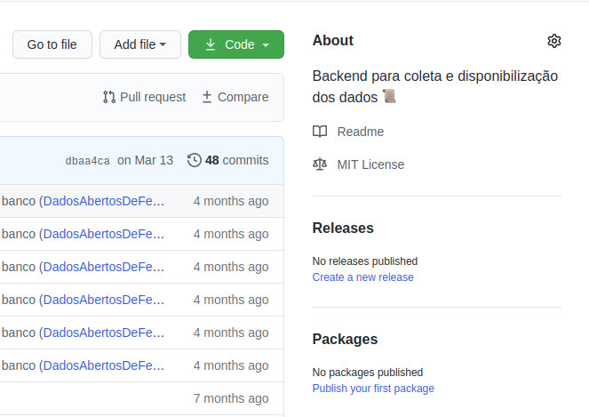

Quando se é iniciante, tudo parece muita coisa. E, se você é assim como eu, você tem uma necessidade lá no fundo que precisa sanar antes de colocar em prática qualquer coisa: estudar TUDO que tem sobre o assunto. Mas se tem uma coisa que aprendi nesse mais de um ano estudando programação e me dedicando a aprender ciência de dados é que ir fazendo é necessário no processo de compreensão e de aprendizagem, assim como tudo que aprendemos. Então como iniciar?

Eu comecei me envolvendo com comunidades de tecnologia voltadas para mulheres, como a [PyLadies DF](https://www.facebook.com/pyladiesdf) e [Devs JavaGirl](https://twitter.com/devsjavagirl). Nessas comunidades temos projetos e outras ações que nos ajudam no processo constante de aprendizagem. Entretanto, gostaria de projetos mais focados em dados. Foi aí que eu achei o projeto de [Dados Abertos de Feira](https://www.dadosabertosdefeira.com.br/) que coleta e analisa os dados abertos do município de Feira de Santana na Bahia. Especificamente me interessei pelo [Mária Quitéria](https://github.com/DadosAbertosDeFeira/maria-quiteria), que é o backend para coleta de dados abertos. Dali conversando com a [Ana Paula](https://twitter.com/AnaPaulaGomess), percebi que há muitos issues que eu poderia me desafiar a resolvê-los.

#### E o que são os issues?

Issues são uma forma de monitorar e acompanhar ideias, melhorias e bugs do projeto. Assim, cada repositório listado na página principal do GitHub do Dados Abertos de Feira possui seus próprios issues.

#### Mas tá, como começar?

Para ínicio de conversa, sempre que for se envolver em algum projeto open source é importante entender de onde veio e quais os objetivos. Esses projetos são geralmente criados por voluntários com objetivos marcantes para as comunidades de onde vieram.

No caso do Maria Quitéria, tanto no site do Dados Abertos da Feira quanto no GitHub, é possível já ter uma noção do que levou à criação do projeto e quais objetivos estão em jogo. E para iniciar a colaboração ao projeto, é essencial começar pelo tal do [README.md](https://github.com/DadosAbertosDeFeira/maria-quiteria/blob/master/README.md). Além dele, o Mária Quitéria conta com o [código de conduta](https://github.com/DadosAbertosDeFeira/maria-quiteria/blob/master/CODE_OF_CONDUCT.md) e o [guia de contribuição](https://github.com/DadosAbertosDeFeira/maria-quiteria/blob/master/CONTRIBUTING.md), sendo este último um documento bem importante para te guiar em suas contribuições. Sugiro iniciar pelo código de conduta, depois o guia de contribuição e por fim o README.md.

#### Mão na massa - ou melhor, no código!

Se você não for muito familiarizada com o Scrapy, sugiro fazer esse tutorial [aqui](https://docs.scrapy.org/en/latest/intro/tutorial.html) antes.

1. Faça um fork do projeto com uma nova branch para que você tenha uma cópia do código na sua conta do GitHub.

2. No fork que você fez para sua conta, é possível agora clonar o repositório para o seu computador. Assim você pode abrir o projeto em um editor de sua escolha pra trabalhar no issue que você escolheu! Para fazer isso vá no botão de <strong>Code</strong> e copie o link que aparece na caixinha.

3. Abra seu terminal e vá para o local onde você quer clonar o repositório e insira o seguinte comando de git:

    <pre><code>git clone https://github.com/(seu-username)/maria-quiteria.git</code></pre>

    Observe que ali em parênteses vai constar o seu username do GitHub!

    Se você não estiver ainda dentro da pasta que você acabou de clonar, digite o seguinte comando para chegar até lá:

    <pre><code>cd maria-quiteria</code></pre>

Agora que você sabe onde está a pasta e o projeto onde vai precisar trabalhar, é importante você seguir o passo-a-passo da [página inicial do projeto](https://github.com/DadosAbertosDeFeira/maria-quiteria) para verificar se tudo está rodando certinho.

Para escolher no que você vai contribuir, veja a [lista de issues](https://github.com/DadosAbertosDeFeira/maria-quiteria/issues) e procure aqueles que tenham a tag <em>"good first issue"</em>. Os issues com essa tag são mais indicados para pessoas iniciantes, mas se você quiser outro, não tem problema! Converse em alguns dos canais de comunicação do Dados Abertos de Feira para tirar dúvidas. Há um grupo no [Telegram do Dados Abertos da Feira](https://t.me/dadosabertosdefeira) que você pode participar!

E então você achou o que queria? Comente no issue pra saberem que você tá cuidando dele!

Siga as instruções no issue para saber em qual arquivo trabalhar e onde está a questão a ser resolvida, para isso, abra o projeto em seu editor e faça as mudanças necessárias e teste localmente! 

#### Deu tudo certo! Como faço para enviar o que eu fiz?

Antes de mais nada, instale localmente o [pre-commit](https://pre-commit.com/ "Instale antes de enviar o PR!"). Isso vai fazer com que o seu código já fique formatado de acordo.

No terminal, veja as mudanças que você fez por meio do comando

<pre><code>git status</code></pre>

Depois envie essas mudanças:

<pre><code>git add --all</code></pre>

<pre><code>git commit -m "Adiciona funcionalidade"</code></pre>

Esse comentário em aspas é apenas um exemplo utilizando o tempo presente, conforme a orientação do guia de contribuição. É nesse espaço entre aspas que você vai resumir o que o seu código faz.

Agora é hora de subir pro seu GitHub. Ainda no terminal, digite o comando

<pre><code>git push -u origin master</code></pre>

Ficou ainda na dúvida de como commitar? Siga o tutorial do Django girls na parte de [Deploy](https://tutorial.djangogirls.org/pt/deploy/)! Até hoje uso pra me lembrar dos passos certos para fazer o commit para o GitHub. 

Depois disso é possível ir até seu repositório no GitHub e buscar por um botão de <strong>compare & pull request</strong>. Ao abrir o pull request, é importante escrever um resumo do que faz o código, para sinalizar o que é aquele pull request. Ao terminar de preencher tudo, crie seu pull request!

Pronto! Agora é esperar a revisão do seu pull request.

E foi assim que eu fiz o meu primeiro pull request, ou o tal do PR. Programação é aprendizado constante, e é mais legal quando você se envolve em projetos com objetivos tão democráticos, como é o caso do Dados Abertos de Feira.

>Esse post tem bastante referência do passo-a-passo escrito por Brandon Morelli que você encontra em inglês [aqui](https://codeburst.io/a-step-by-step-guide-to-making-your-first-github-contribution-5302260a2940).